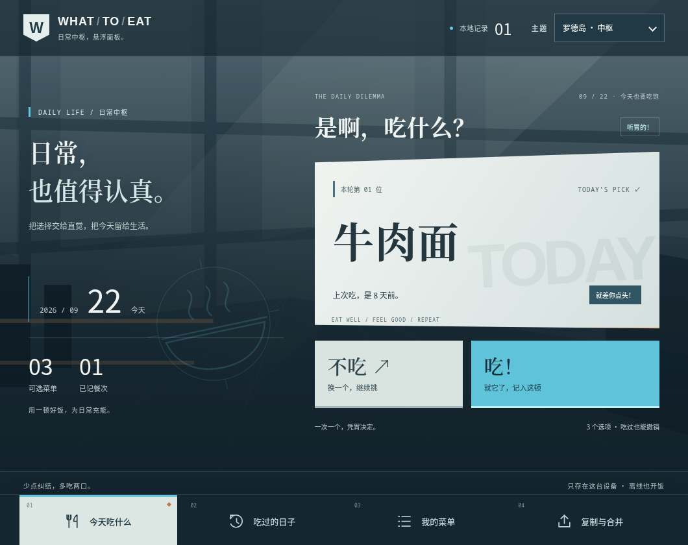
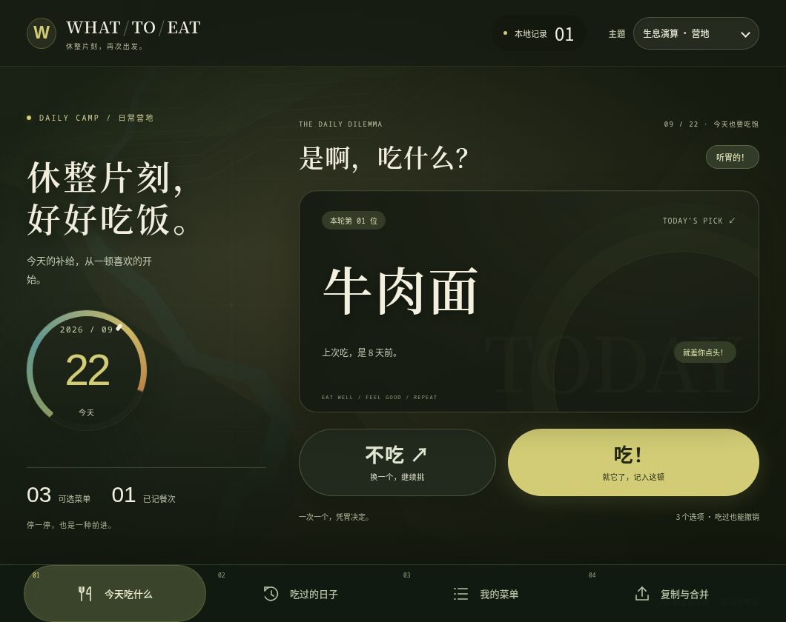
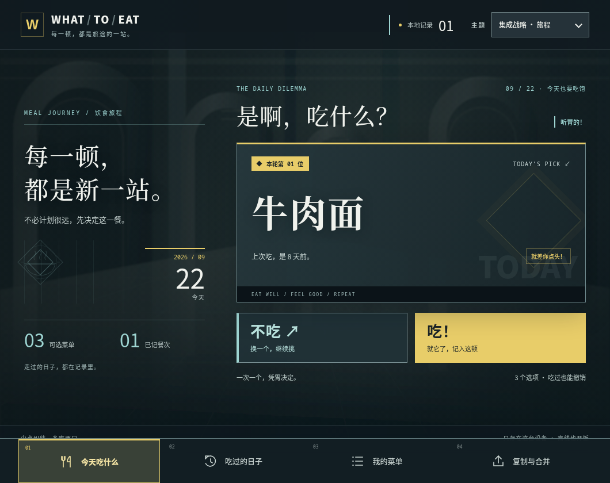

# UI 首版验收与预览

2026-09-22。已实现「罗德岛 · 中枢」「生息演算 · 营地」「集成战略 · 旅程」，在主题下拉框的「界面主题」分组中选择。原五套配色及已有选择保持兼容。结构映射和动效边界见[实施蓝图](implementation.md)。

## 预览

以下是本应用真实 Dioxus 组件的 SSR 截图，使用明确的示例数据，不连接用户数据库。尺寸是 CSS 像素；桌面图为 1060 × 840，手机布局图为 390 × 840。它们展示界面，不代表已在安卓真机运行。

| 界面 | 桌面 | 手机布局 |
| --- | --- | --- |
| 中枢 | [查看桌面](previews/control-1060.png) | [查看手机](previews/control-390.png) |
| 营地 | [查看桌面](previews/reclamation-1060.png) | [查看手机](previews/reclamation-390.png) |
| 旅程 | [查看桌面](previews/expedition-1060.png) | [查看手机](previews/expedition-390.png) |

### 中枢



### 营地



### 旅程



旅程的连接线只用于真实饮食历史，按食用时间排序；当前推荐始终只有一个，不增加虚构的资源、路线或多候选选择。

## 实际检查结果

| 检查 | 结果 | 能说明什么 |
| --- | --- | --- |
| Rust 业务/组件测试 | 39 项通过 | 推荐、记录、修改、撤销、合并、迁移、主题持久化与回滚、通知计时器的现有测试通过；主题持久化循环覆盖新增项 |
| 格式 | `cargo fmt --all --check` 通过 | Rust 格式符合项目约定 |
| 静态检查 | `cargo clippy --features desktop,preview --bins --offline -- -D warnings` 通过 | 桌面/预览目标无 Clippy 警告 |
| 桌面与预览构建 | `cargo build --features desktop,preview --bins --offline` 通过 | 新 CSS 和 SVG 随二进制编译，无运行时下载 |
| 安卓 ARM64 | `cargo check --target aarch64-linux-android --features mobile --bin whatoeat --offline` 通过 | Rust 移动目标编译检查通过；沿用现有 NDK，未更换 JDK/SDK |
| Chromium 布局 | 94 / 94 场景通过 | 新主题四页面 × 四宽度；空闲、空菜单、全部跳过、已记录、过期、加载、长名称、忙碌；长历史及通知；旧五配色窄/宽屏回归 |
| 目视复核 | 六张桌面/手机主题图及修订图已查看 | 修复手机标题断句、隐藏的历史节点、通知图标同色和营地顶部安全区 |

布局脚本检查横向溢出、单候选、表单/按钮边界、固定导航、滚动到底部的页脚、通知不移动布局、减少动态效果和可解析纯色控件文本对比度。[摘要与截图校验值](previews/verification.json)保留机器可读结果。

新主题在桌面和窄屏均使用固定底部导航；旧配色继续采用既有桌面侧栏/手机底栏。新主题的提示靠近底栏上方，仍使用统一出口和原有自动关闭逻辑。

## 实现边界

- 原作截图仅留在研究目录；应用运行资源是原创 SVG 与 CSS，没有引入游戏立绘、标志或原图背景。
- 共享 `Shell`、推荐、历史、菜单、备份组件；新增概览和装饰层，没有复制业务处理逻辑或修改数据模型。
- 投影式四边形由装饰轮廓表达，关键正文保持可读；短入场/悬停/按下为本应用自定反馈，减少动态效果时停用。
- SSR 检查没有 Dioxus 事件绑定，不能视作全部流程的浏览器端到端测试；实际业务与通知行为由现有 Rust/组件测试覆盖。
- 本轮没有重新生成 APK，也没有安卓真机检查。触摸、软键盘、系统栏和设备 WebView 的最终体验仍需设备验收。桌面窗口启动检查不替代对新主题全部操作的原生验收。
- 透明背景、渐变和 SVG 叠加的对比度不在数值脚本的自动保证范围；它们进行了截图目检。

## 重现检查

```sh
cargo test --no-default-features --lib --tests --offline
cargo clippy --features desktop,preview --bins --offline -- -D warnings
cargo build --features desktop,preview --bins --offline
PLAYWRIGHT_MODULE=/path/to/playwright node scripts/check_ui.cjs
```

脚本默认输出到系统临时目录 `whatoeat-ui-check`；可用 `UI_CHECK_OUTPUT` 指定位置。环境变量与逐种状态的说明见[实施蓝图](implementation.md)。

## jj 检查点

研究基线是 `stywssun`。本轮 UI 变化使用稳定 change ID `wxztsukn`，包含界面、预览工具和验收文档；最终 commit ID 可通过 `jj log -r wxztsukn` 查询。完成后创建空的新工作 change，不推送远端。

后续优先在安卓设备验收，再根据真实使用反馈调整密度与对比度；如果继续提高原作动效还原度，单独补充 P3 连续交互证据。
