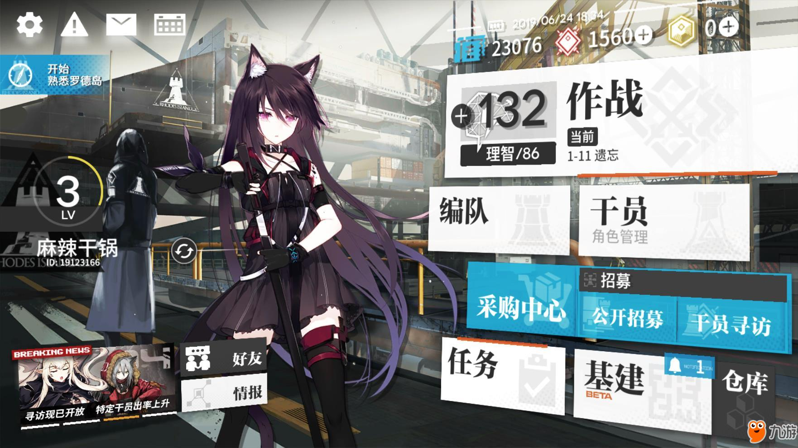
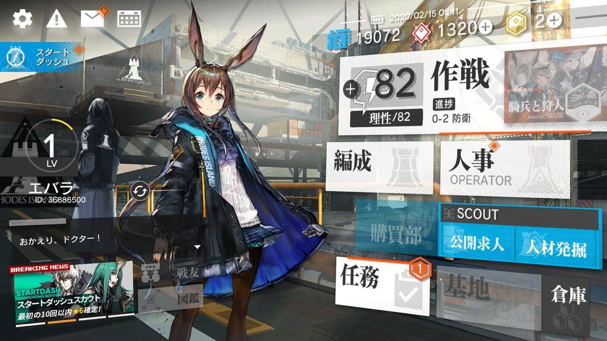

# 01 · 传统主界面：悬浮工作台与分层导航

状态：完成静态取证；动效、交互状态与竖屏适配待取证。记录日期：2026-09-22。本文只分析参考画面，不定义最终 CSS、组件或动画。

## 参考样本与可信范围

本研究选取同一类传统主界面的两个语言版本，用来区分稳定的构图特征与账号、立绘、活动内容带来的变化。它们是 **2019—2020 年的历史样本**，不代表当前游戏版本，也不代表后续可购买的其他主界面样式。

| 编号 | 原始画面 | 来源与时间 | 确认程度 |
| --- | --- | --- | --- |
| HOME-01，主要分析对象 | 简体中文主界面，1762 × 991，约 16:9 | [九游攻略原页面](https://www.9game.cn/mrfz/3267597.html)发布于 2019-06-25 09:21；截图内显示 2019/06/24 18:44 | 页面确实引用该图；为第三方发布的游戏截图，右下有九游水印；具体客户端构建号和设备未知 |
| HOME-02，交叉检查 | 日文主界面，1152 × 648，16:9 | [ゲームUIブログ原页面](https://gameui.matme.info/blog/archives/63707)显示 2020-02-17 / 2021-01-05；图内显示 2020/02/15 03:11，原文件名也含 20200215 | 页面 HTML 直接链接该图；具体客户端构建号、设备及截图是否经过缩放未知 |

截图中的日期只证明画面显示的日期，不独立证明服务器时间、文件创建时间或版本号。网页日期也不等于游戏版本。

### HOME-01

[原图直链](https://image.9game.cn/2019/6/24/85810427.jpg)。本地保留下载到的原始 JPEG 字节，未裁剪、去水印或重编码。

### HOME-02

[原图直链](https://gameui.matme.info/blog/wp-content/uploads/2020/02/Screenshot_20200215-031141.jpg)。本地保留下载到的原始 JPEG 字节，未裁剪或重编码。

下面的结论来自对两张原图的直接观察，不采用图片搜索自动生成的说明作为证据。两张图片属于研究引用资料；不将人物、标志、截图或游戏原始美术直接加入应用运行资源。

## 直接观察：画面不是等宽卡片列表

### 1. 总体空间与视觉重量

画面是一张完整的工业场景，上面叠加人物、导航板、状态与附属信息。左侧人物很大，右侧功能面板很亮，两者共同构成视觉中心；没有把整个屏幕先切成统一等宽的应用栅格。

- **右侧主功能群**约占画面宽度的后 45%。顶部“作战”面板最大；下面是两块中等面板，再往下是一组青蓝功能区，底部是任务、基建、仓库。大小、明度和位置同时表达层级。
- **左上工具组**用独立白色图标排列，包括设置、警告、邮件、日历。它们尺寸接近、间隔相对均匀，不与右侧大功能板抢同一层级。
- **左中身份组**把圆环、大等级数字、账号名叠在暗色横条上。账号名和等级被分配不同阅读尺度，背景徽记比正文更淡。
- **左下新闻及社交入口**占更低的横向位置，新闻以图片和细条标题吸引注意，社交入口靠近新闻旁边；它们没有复制主功能大卡片的重量。
- **角色并非居中对称装饰**：身体占据画面中左区域，局部与账号、对话及辅助板重叠；人物轮廓形成不规则留白，右侧操作区保持可读。

以 HOME-01 为基准，以下是人工读图得到的粗略地标。坐标原点为左上，x/W、y/H 均为百分比，误差约 ±2%；它们用于讨论构图，不能当作落地尺寸或触控区域。

| 区域 | 大致包围范围（x，y） | 主要作用 |
| --- | --- | --- |
| 左上工具 | x 2–23%，y 2–9% | 短距离工具查找 |
| 账号与等级 | x 0–17%，y 34–60% | 身份与进度 |
| 人物主体及扩展轮廓 | x 19–58%，y 9–100% | 视觉焦点、情绪背景 |
| 作战主面板 | x 56–100%，y 11–40% | 最强的功能入口 |
| 右侧次级功能群 | x 54–100%，y 41–100% | 分组导航 |
| 新闻及社交 | x 1–34%，y 76–97% | 辅助入口与动态消息 |

**观察边界：**这是横屏游戏的静态布局。不能据此声称把同样比例压缩到 360 px 竖屏仍然可用。

### 2. 形状：矩形母题经过分组变形，尖角不是唯一特征

多数板块以矩形为母题，直角、薄边、硬边界比圆角胶囊更常见。不同区域使用的几何语法并不相同：

- 功能板是较大明暗色面，面板内部有淡色徽记或图形。
- 顶部资源为小图形、数字和“+”的组合，依靠重复基线与间隔成组，外围没有每项都加厚边框。
- 小通知采用外置标记。HOME-01 基建上的青蓝通知牌跨过板块边缘；HOME-02 人事上有橙色菱形、任务上有橙色多边形计数标记。
- 账号等级保留圆形进度环；小工具和资源中也有圆形“+”。因此“全界面都必须是斜切矩形”不符合样本。
- 下沿橙色细条局部跨越或贴近板块边界，承担强调作用；它不是每个卡片都具有的统一厚描边。

### 3. 倾斜、旋转与透视需要分开记录

**可见事实：**右侧板块的上边、下边和内部文字基线有不同程度的斜向变化。以 HOME-01 的“作战”白板为例，人工估计左上角约 (988,167)，右上角约 (1755,110)，左下约 (981,392)，右下约 (1754,389)。上边明显向右抬高，下边近乎水平；对边并不平行。右下板块的下缘整体又向右降低。这些关系构成一个向画面右边展开的空间感。

**几何解释：**

- 单纯二维旋转会保持矩形对边平行，不能解释上述四边关系。
- 单纯仿射斜切也会保留平行关系，不能完整解释该面板。
- 画面与“带透视投影的平面板”或手工制作的透视四边形相容；仅凭截图不能确认游戏使用 3D 相机、透视变换、预变形贴图还是几者组合。
- 并非所有 UI 共享同一变换：左上白色工具更接近屏幕平面，底部新闻有自身倾角，右侧多个板块在更大的空间关系里排列。不能对整个应用外壳统一加一个角度就称为复现。

角色和场景自身的绘画透视，也不能被当作 UI 面板采用真实 3D 的证据。今后如需要测量投影，应在同一帧标记同一个平面的四角及文字基线，再跨帧验证；本文角点只用于说明为什么不能把“斜”全部归为 `skew`。

### 4. 颜色：中性色承载内容，青蓝与橙色承担有限职责

大面积 UI 为近白、深灰与半透明暗色；工业背景整体偏灰，人物保留完整颜色。青蓝集中在采购和招募等板块、资源图标及少量通知上。橙色主要出现在细线和小标记。金、红等色出现在不同资源图标；不能把这些颜色全部归为“主强调色”。

下表是 HOME-01 原 JPEG 上以指定像素为中心的 **5 × 5 区域、各 RGB 通道中位数**，使用 Pillow 读取，原点为左上，零起始坐标。它们是截图观测值，包含 JPEG 压缩、光照或透明叠加的影响；不是官方色板，更不是本项目的最终 token。

| 样本位置 | 坐标 x,y | 中位色 | 解释范围 |
| --- | --- | --- | --- |
| 编队白板内部 | 1005,429 | `#F9F9F9` | 局部近白底面 |
| 采购青蓝区域 | 1070,622 | `#24AAD0` | 局部有纹理的强调底面 |
| 招募深色标题条 | 1690,635 | `#404040` | 局部深灰承载面 |
| 作战下沿橙条 | 1630,384 | `#D8602C` | 局部强调细线 |
| 作战标题笔画内部 | 1390,222 | `#2E2E2E` | 局部深色文字 |

HOME-02 仍保留近白主板、青蓝功能群、橙色通知、灰色场景的分工，但部分入口在该状态下更透明或更暗。**由静态图不能确定是功能锁定、状态差异、透明度调整，还是客户端差异。**

### 5. 文字：多种字形与层次共同参与构图

两张图的大功能标题都有明显的笔画粗细变化和衬线/宋体式特征，不能概括为“全局粗黑无衬线”。资源数值、英文说明和小型状态文字则更接近无衬线。具体字库名称未经核实。

可观察到至少四个文字尺度：

1. “作战”与理智数值作为主面板焦点，字号明显大于附近文字。
2. 编队、干员、任务等功能名是导航主语，靠近板块一侧放置。
3. “角色管理”、日文图的 `OPERATOR` 等副说明更淡、更小；与主标题没有相同的重量。
4. 日期、关卡编号、账号编号与边角提示更密集，承担查阅用途。

板面内还有淡到接近背景的巨大符号、徽记或英文字样。它们与前景标题重叠或错位，形成“后层图形—前层功能文字”的关系。**这些背景图形不是额外必须阅读的信息。** 前景标题与后层水印不能一起使用同样对比度。

大标题往往跟随所在板块的投影方向；角标、通知和外部状态条可能悬在板块前方。具体层级由遮挡关系可见，但实际 z 值、阴影参数、文字是否独立变换不能从像素反推出唯一答案。

### 6. 层叠与深度：依靠遮挡、明暗和对比建立

可把读到的层次概括为：场景 → 人物 → 功能面板及账号条 → 正文与资源信息 → 局部通知/活动标识。这只是视觉阅读顺序，并非已确认的引擎渲染顺序；局部会交错。

- 背景场景保留空间线索，但弱于高亮功能板；不需要把所有背景都纯黑化才能得到工业感。
- 面板下方可见暗影和周围遮挡，明亮板面像悬于场景前方。
- 新闻图片、徽记、文字、资源数值处于不同视觉重量。一个完全平铺、所有卡片同样边框同样阴影的界面会丢掉这种层次差异。
- 较浅的水印与图标处于板面后层，前景功能名保持清晰边缘；层叠不是无差别叠满装饰。

### 7. 信息密度与状态：颜色不等于“选中”

主界面同时容纳账号、资源、工具、活动、功能与通知，密度高，但不同类型通过位置和尺度分区。主入口较少使用完整句子；密集的小字被集中在资源、日期、关卡等区域。

右侧面板在此处表现为“进入某功能”的入口，而不是已展开页面的常驻侧栏。HOME-01 的蓝色采购和招募同时存在，不能推断蓝色就是当前选中项；白板也不表示未选中。橙线、通知角标、活动内容都可能有不同语义，必须逐项查证。

目前没有捕获按下、焦点、悬停、禁用和二级页面返回后的对照帧。HOME-02 某些变暗面板只能描述为“更暗/更透明”，不能直接标成禁用样式。也不能把新闻上的活动色当作全局状态规则。

## 解释与待验证假设

以下是基于上述观察的设计解释，并非源游戏作者披露的设计意图，也不是本项目已经决定实现的方案：

| 解释或假设 | 图像支持 | 后续需要验证 |
| --- | --- | --- |
| 主界面的识别主要来自空间编排与层级，而不只是冰蓝色 | 两种语言仍保留人物/场景/右侧功能群及不同大小板块 | 去掉角色美术后，结构是否仍有足够识别度 |
| 透视感服务于一组“悬浮工作台”，各区域可能有独立运动关系 | 不同区域具有不同投影和倾角 | 录屏中的视差、转场，以及是否随输入变化 |
| 低对比大图形能增加信息板质感而不增加阅读负担 | 水印与正文有明确对比差 | 本项目长中文菜名、数字与错误提示下是否仍可读 |
| 本项目应研究“单个决策主面板 + 次级管理入口”的主次关系 | 源图“作战”比其他板块更大更亮 | 先做信息架构草图比较；不要把所有原游戏入口照搬 |

可能借鉴的对象是形状关系、层次和阅读秩序；具体人物、阵营标志、账号数据以及原游戏文案不作为本应用内容。上述假设的实现顺序由总研究计划管理，当前不编写 CSS 或动效。

## 动态证据缺口与下一次采样清单

**静态截图无法证明动画存在，更不能给出持续时间或缓动函数。** 当前所有运动参数都标为“未知”。后续使用带来源与时间码的真实录屏，至少覆盖：

| 要回答的问题 | 最少证据 | 当前状态 |
| --- | --- | --- |
| 登录完成后，背景、人物、菜单是否分批出现 | 完整进入主界面的片段，保留前后约 1 秒，记录原始帧率 | 未获取 |
| 点一个主入口时，整组面板如何离场 | 主界面 → 功能页 → 返回的连续片段 | 未获取 |
| 是否存在跟随触摸、指针或设备倾斜的视差 | 同一页面持续操作，并能区分输入来源的录屏 | 未获取 |
| 常态是否有呼吸、扫光、纹理或通知闪动 | 无输入停留至少 5 秒 | 未获取 |
| 按下、禁用、焦点和通知消失各怎样反馈 | 同一元素至少两种状态的连续画面 | 未获取 |
| 各层运动的先后、时长及缓动如何测量 | 原速连续帧；标记触发帧、首次变化帧、停止变化帧 | 未获取，不能填写毫秒或曲线 |

即使后续测出原游戏运动，也需另行决定本应用的减少动态效果、键盘焦点、Android 触摸目标及竖屏可读性。源截图不提供这些产品要求的答案。

## 文件核验

下载与视觉检查：2026-09-22；核验时钟读数 14:36:12 UTC（香港时间 22:36:12）。

| 文件 | 字节数 | SHA-256 |
| --- | ---: | --- |
| `home-cn-20190624.jpg` | 225939 | `c0c03fd3027893ff84259e19f01fc371353e75291930b969a892b6a3862f9e7e` |
| `home-jp-20200215.jpg` | 193535 | `1803eea16647ddd9ac32a07c0e744cf04a80de7e91e9cc98609cdb0e5539fa0d` |

网页与图片地址可能随时间失效；上述本地原图、来源、哈希及观测坐标一起构成本次可复核的静态基线。
