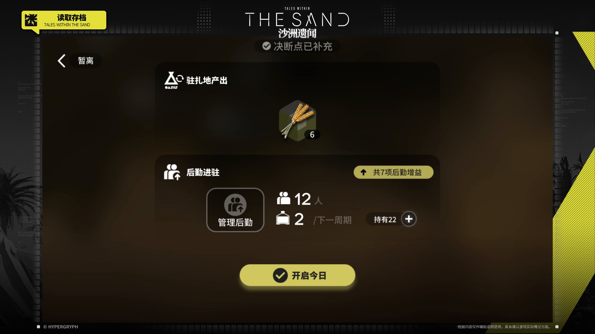
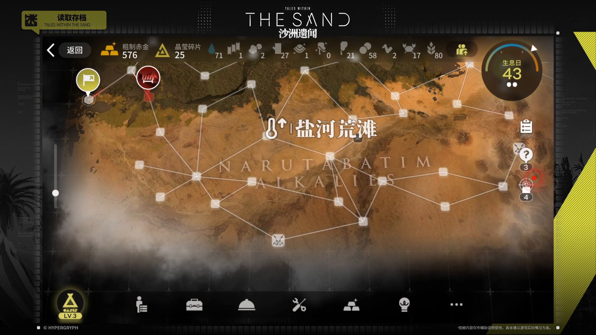

# 02 · 生息演算「沙洲遗闻」界面研究

状态：参考采集、静态结构分析已完成；**本轮不实施 CSS 或动画**。采集日期：2026-09-22。

选题不是“沙色皮肤”，而是研究一个管理与探索界面如何通过地图、状态盘、资源栏和分层面板组织信息。正式主题名以官网为准，使用「沙洲遗闻」。本篇不把「火中沙」或其他生息演算主题混为同一套设计。

## 证据与适用范围

两幅图都来自[明日方舟官方「沙洲遗闻」专题](https://ak.hypergryph.com/ra/taleswithinthesand)内的「玩法介绍」，属于一手演示资料。并非社区重绘，也不是当前客户端截图。视频未给出客户端版本；本研究不能证明 2026 年现行版本仍与之完全一致。地图上的“生息日 43”是游戏状态，不是版本号。

| 编号 | 画面及观察目的 | 原片时间 | 本地原帧 |
| --- | --- | --- | --- |
| RA-01 | 日开始前总览：驻扎地产出、后勤进驻、单一主要行动 | 00:01:11.560 | [ra-01-day-overview.png](../references/reclamation/ra-01-day-overview.png) |
| RA-02 | 区域地图：盐河荒滩、资源栏、节点、日期和底部功能区 | 00:01:15.200 | [ra-02-region-map.png](../references/reclamation/ra-02-region-map.png) |

原片：[官方 MP4](https://web.hycdn.cn/arknights/ra/sandbox_1/pv/tutorial_video.mp4) · [官方 HLS](https://web.hycdn.cn/arknights/ra/sandbox_1/pv/tutorial_video.m3u8)。两帧对应 HLS 第 7、8 段内的 6、2 秒；时间按播放列表累计，视频 25 fps，定位误差约一帧。保存的是 1920 × 1080 全帧 PNG，未裁剪、缩放、改色或修图。它们是视频解码帧，**不存在独立的“原始截图 URL”**；原视频、分段 URL、大小与 SHA-256 在 [metadata.json](../references/reclamation/metadata.json)。未将整段视频放入仓库。

**首先排除节目包装的干扰。**两帧外层的黑色斜纹、右边荧光黄折线、顶部英文标题、左上章节牌属于教学视频包装。真正的游戏视口约为整帧 `(136, 117)–(1784, 1044)`。下文的游戏 UI 观察限于该区域。外框可单独成为平面设计参考，但不能据此说游戏页面到处有斜切卡片。

本次得到的是“日开始前总览＋区域地图”，不是活动进入页面。活动入口与存档选择仍列为后续补证，不能用总览替代其分析。

## RA-01：日开始前总览

### 观察

- **构图和尺度**：内容被收拢在中央一列，约占游戏视口宽度的 56%；左右保留暗色空间。上半部分是产出，下一块是后勤，底部黄色“开启今日”成为最清晰的下一步。不是每个区块都争取相同的面积和亮度。
- **形状**：大信息板使用明显圆角的深色矩形；小状态采用胶囊；管理后勤是带细描边的圆角方块；右侧数量入口是圆形加号。主要按钮是长胶囊，内含深色圆盘与勾。这里的识别点是圆形仪表语言与厚实的软边面板，不能归纳成“方舟＝全部尖角”。
- **颜色职责**：棕黑色背景与近黑面板占大部分面积；白色给标题、图标和关键数字；灰色给说明与单位；低饱和黄绿给收益徽标和确认行动。黄绿色只占小面积，因而有明确的优先级。小麦图像保留自然色，与单色图标形成区别。
- **文字层级**：模块标题是中等大小的粗黑体；核心数量如“12”“2”更大、更轻；单位与周期说明更小、更灰。强调依靠大小、字重和对比度，未观察到正文整体斜排。准确字体家族无法从视频确认。
- **图层顺序**：背景褐色场景/模糊面 → 深色面板 → 图标、标题和数量 → 胶囊状态与按钮。底部主要按钮周围可见柔和亮晕；物品图以立方体底座、遮挡和投影体现体积。
- **倾斜与透视**：面板边缘与文本基线总体水平/垂直，没有证据支持对整块 UI 做剪切或旋转。小麦底座的斜面属于物品插画的三维表现，不是文字或容器透视。外层视频的斜纹不计入本判断。

### 推断

此页面更像一天行动前的简报：由“已有资源/增益”向“开始下一步”推进。中部低亮度容器降低次要功能的竞争，唯一宽亮按钮将行动收束到下方。这是静态层级的解释；尚未验证真实触摸热区、焦点顺序及按钮交互。

## RA-02：区域地图

### 观察

- **布局骨架**：游戏视口中央是大面积地图画布，顶部贴资源横栏，底部贴图标功能区；右上日历圆盘压在地图和上栏的交界处，右边另列任务/事件入口。视线并非从很多等宽卡片顺序扫描，而是在固定工具边缘与中心空间之间切换。
- **地图底层**：赭黄、土棕、灰绿地貌纹理构成底图；深色边缘与浅灰雾遮住远处。地图不是一张均匀的纯色背景，存在地形颗粒、明暗区域和可见边界。
- **路径和节点**：浅色细线连接半透明的小圆角方块；不同方向的线段是地理连接，不是 UI 全局倾斜。普通节点视觉重量很低，旗标/敌袭使用更大的圆形标记、白描边和向下尖尾。节点的等级由尺寸、轮廓、填充共同表达，不能只换红黄颜色。
- **状态与主次色**：常规路线、文字和资源图标为灰白；当前位置/营地标记偏黄绿；敌方标记偏红；日期弧含蓝、黄、橙色。黑褐背景支撑这些少量状态色。红色警示的准确业务语义仍应结合游戏操作确认，不能由截图替应用直接定义规则。
- **时间圆盘**：右上黑色圆形内有较小标签、很大的日期数字、两个白点，外围为未闭合的分段渐变弧和白色指针。这是独立信息组件；把圆盘替换成一行日期文字会明显改变界面性格。白点与游戏决断数量的对应关系不能只凭两帧宣布已经验证。
- **文字图层**：区域中文名是较大的白色衬线字，带暗色轮廓/阴影以离开地形纹理；其下的英文地名使用大写、疏字距、低对比度，面积很大但阅读优先级较低。资源栏则是紧密排布的小图标与数字，日期是大数字。这些层级共存，避免“全部大字”或“全部等宽”造成的扁平化。
- **遮挡与深度**：地貌在底，英文地名压在其上，线路与节点更清楚；雾与暗边限制底图可见度；资源栏和底栏以深色覆盖地图；大圆盘位于前景。这里的深度主要来自明暗、透明度和遮挡，并没有足够证据证明存在真实三维镜头或动态视差。
- **几何判断**：中文标题和状态文字基线基本水平；上栏和下栏保持屏幕坐标系；地图线网有任意角度却没有共同灭点。静态图不能支持给整个页面套 `perspective()` 或统一 `skew()`。前景别针的尖尾是轮廓形状，也不等于剪切变换。

### 推断

地图承担空间关系，边缘工具承担稳定访问，右上圆盘承担当前阶段。视觉风格由这三者的结构关系形成，沙色只是其一。它适合有“探索、分支、阶段”语义的页面；若食物候选之间没有真实关系，硬画线路会制造错误暗示。

## 颜色采样的边界

以下是归档视频帧上 7 × 7 像素区域的通道中位数，坐标针对完整 1920 × 1080 帧，只用于讨论色彩角色；不是官方设计 token，也不是本项目建议最终采用的值。视频压缩、半透明叠加和场景光照会改变读数。

| 图/位置中心 | 可见区域 | 样本 |
| --- | --- | --- |
| RA-01 `(817, 880)` | 主要按钮黄绿填充 | `#d0c75e` |
| RA-01 `(530, 510)` | 深棕黑面板 | `#171107` |
| RA-01 `(340, 600)` | 背景暗部 | `#1b150b` |
| RA-02 `(1240, 450)` | 地貌棕色区域 | `#613e22` |
| RA-02 `(516, 636)` | 半透明节点与底图的合成色 | `#dacbbd` |

## 对“今天吃什么”的应用假设：等待设计阶段验证

| 可借鉴的结构 | 应用假设 | 必须避免的问题 |
| --- | --- | --- |
| RA-01 的中心简报与唯一主行动 | 推荐页的候选名、距上次食用时间、吃/不吃形成明确层级；确认后再出现简报状态 | 不能让装饰或确认动画拖慢连续选择；“不吃”仍需容易找到 |
| RA-02 的固定边缘工具与中心内容 | 保留现有固定底部导航，把关键操作与可滚动内容分层 | 直接照搬横屏密集资源栏会挤坏竖屏；需要另作窄屏构图 |
| 日历圆盘与少量状态标记 | 展示今天日期或食用间隔；状态信息同时有文字 | 不把学习概率画成未经定义的游戏进度；不要发明会误导的“行动点” |
| 地图上前景/背景分层 | 低对比装饰地形或网格留在背景，真实菜名与记录始终清晰 | 不将正文置于高频纹理上；不绘制没有业务含义的节点连接 |
| 地名大小字与疏密对照 | 中文菜名承担阅读，英文/序号最多充当辅助或装饰 | 菜名不是必须译成英文；关键数据不能使用低对比装饰层 |

以上不是批准后的组件方案。本轮没有创建主题 CSS、动画、布局变体或产品贴图。归档图也不应直接随应用发布。

## 动效证据缺口与下一步

本次实际检查了若干静态解码帧，未连续测量动画；因此不记录虚构的时长、速度、缓动、物理弹性或视差系数。

1. 补活动入口/存档选择的完整画面，确认主题首屏与局内地图是否采用同一几何语言。
2. 在原片中观看并逐帧比较“日简报进入地图”“点选节点”“展开资源/状态详情”，分别记录触发、前态、后态、持续帧数、遮挡顺序。剪辑转场须与游戏交互区分。
3. 核对文字是否独立移动、背景是否真实视差、日历盘是旋转还是内容替换。视频讲解中的黑屏剪辑不能直接当作游戏动画。
4. 至少再找一组同主题不同状态、不同视口比例的证据，确认布局不是恰好适用于这两帧。
5. 有上述证据后再进入项目线框和动效分镜；桌面、安卓竖屏、减少动态效果三种场景都要定义。当前研究不直接指定 CSS 属性与动画常数。
