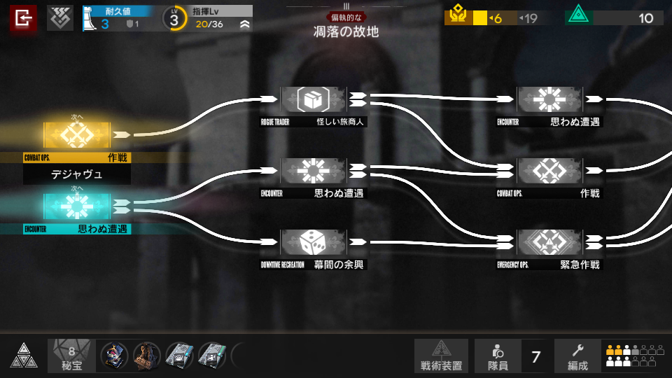

# 03 · 集成战略：傀影与猩红孤钻的路线选择

状态：静态图像研究完成；未进入 CSS 或动画设计。研究日期：2026-09-22。

## 样本 IS-01

| 项目 | 信息 |
| --- | --- |
| 主题与界面 | 集成战略第二主题「傀影与猩红孤钻」；日服名称「ファントムと緋き貴石」；第三层路线选择界面 |
| 来源性质 | 社区玩家实机截图；个人博客「コワレタのフリーゲーム館」，不是官方宣传图 |
| 来源页面 | [「ファントムと緋き貴石」ごくごく平凡なプレイ日記 その５](https://kowaretagames.seesaa.net/article/498250689.html) |
| 页面发布日期 | 2023-02-19；不代表当前游戏版本 |
| 截图时间 | 未核实；原文件名含 `20230203-183259`，只能记录为文件名线索，不能作为已证实拍摄时间 |
| 原图直链 | [Screenshot_20230203-183259.png](https://kowaretagames.up.seesaa.net/image/Screenshot_20230203-183259.png) |
| 本地原图 | `references/integrated/is-01-phantom-route.png` |
| 原图尺寸 | 960 × 540，PNG；原样保存，没有裁切、调色或重绘 |
| SHA-256 | `a68a00ec17631ff45724ff8bdbb713a6eeea7e64e096c67bba4f10ffbf5f1f39` |
| 使用边界 | 研究和对照资料；未作为应用运行资源，也未取得游戏美术素材的再分发许可 |

来源页面明确说明第三层的路线取舍；截图内也能读到层数、层名与分支节点。两者共同支持界面身份。本文的形状、层次及排版判断来自对上述原图的实际查看，不依赖搜索引擎的图片描述。

## 从原图可以直接观察到的特征

| 维度 | 静态证据 | 作用分析 |
| --- | --- | --- |
| 主结构 | 顶部状态条、中央横向分支图、底部工具条。中央节点按列排列，白色箭头由左指向右，右端路径出画 | 页面围绕“下一步走哪里”组织；空白承担连接关系，并非需要填满的间隙 |
| 节点形状 | 图标区是横向矩形，下接窄黑色标题条；节点外轮廓基本直角。图标内部大量使用菱形、叉形、放射线与骰子 | 卡片外框维持稳定阅读，差异集中在节点图标和标签，而不是每张卡片使用不同外轮廓 |
| 路径形状 | 较粗白色曲线加实心箭头，分支会分叉、汇合；箭头在目标卡片前终止 | 连接线本身承载信息，不应退化为装饰底纹；线与节点需要独立层管理 |
| 明暗关系 | 模糊且低对比的建筑背景，前景白色连线、白色图标和文字清晰；未突出节点仍保留可读轮廓 | 远景提供氛围，前景提供操作信息；灰色不等于完全不可见 |
| 强调色 | 左侧下一步节点分别使用黄与青蓝；顶部生命信息偏蓝，资源信息用黄、青绿；左上退出按钮用红 | 颜色承担类型或功能区分。两张左侧节点同时高亮，不能仅凭本图推断“高亮等于当前唯一选中项” |
| 文字层级 | 顶部数值较大，标签较小；节点日文名称配细长的大写英文类别；正文基本白色，强调区使用黑字 | 中等字号名称用于识别，小英文标签形成第二层索引；不能照搬小字尺寸到手机竖屏 |
| 对齐关系 | 节点标签与图标框边缘有错位和外伸；工具栏按矩形区域连续拼接，而不是一组等距圆角按钮 | 构图的张力来自大小差异和局部错位，仍保有清楚的水平与垂直基准线 |
| 倾斜 | 主要文字、节点外框、顶部和底部条带均保持水平。斜线主要位于图标、路径和背景建筑中 | 本界面的辨识度不依靠给整个界面统一倾斜；不能把“明日方舟风格”简化成全局 skew |
| 透视 | 建筑背景存在空间纵深并被虚化；主要界面元素保持正视角，未见可证实的整片 3D 旋转 | 背景纵深和前景二维排版同时成立；没有证据要求在实现时建立 3D 场景 |
| 图层 | 最后方是建筑场景，其上是暗色遮罩、路线、节点图标和文字；上下栏覆盖地图边缘；左侧高亮周围可见光晕 | 先用亮度和遮挡区分层次，再考虑景深；不需要给所有元素添加厚阴影 |
| 状态表达 | 左侧两张节点上方有“次へ”，中、右列节点偏灰；顶部有环形等级标识、资源数值和层信息 | 状态可同时通过文字、位置、明暗和颜色表达，不能只靠颜色 |

这里没有精确识别字体文件、字号、线宽或颜色 token。截图只有 960 × 540；从图上观察出的视觉关系可以作为设计依据，像素值需要未来原型阶段重新测量与验证。

## 信息结构拆解

1. **持久状态在边缘。** 返回、生命、等级、资源、层信息固定在上侧；藏品、队员与编成集中在下侧。主体区域留给本次决策。
2. **近期选择比远期路线显著。** 左侧候选节点颜色更鲜明，远处仍保留轮廓和连线，让用户能在“马上做决定”和“理解后果”之间切换视线。
3. **同一对象有三种识别线索。** 图标、类别标签、具体名称同时出现；前两者帮助快速扫读，具体名称支持确认。
4. **连接关系占有自己的空间。** 大片横向留白有实际信息价值。压缩布局时需要保留箭头方向和分支可辨识度，而不是简单减小卡片间距。

## 对“今天吃什么”的设计启发：尚未实施的假设

以下是本项目的设计推断，不是对原游戏交互的事实陈述。

- 可把当前推荐作为最清晰的前景对象，把“上次吃过多久”“参考周期”等依据放在次级信息层。数据越次要，越不应该抢走当前选择的视觉重量。
- 饮食历史可研究“路线和节点”的排版语言，用日期和餐次构成路径。但现有产品每次只提供一个候选，不应为了还原截图强行增加多候选决策树。
- 适合继承的是平直节点、窄信息条、分层明暗、独立状态栏和清晰连线，不能仅替换成黄、青、黑配色便称为该界面主题。
- 桌面端可测试横向路径；手机竖屏优先考虑纵向时间线或简化的当前节点，不把整张横屏地图按比例缩小。
- 类型应同时有文字或图标提示；灰阶、颜色感知差异和高对比模式下仍需要区分状态。

## 动效证据与待补证项

**本次没有查看视频或连续帧，动效证据缺失。** 原图可见光晕，不能据此断言存在呼吸、脉冲、流光、视差、镜头移动或路径绘制动画，也不能填写持续时间或缓动曲线。

下一阶段若研究本样本的动画，需要补充同主题真实录屏并记录：来源与版本、进入地图的时间段、选择节点前后、确认后的过渡、静止时是否持续运动。仅在拿到这些证据后，区分原游戏动效规律与本项目自主设计的动效。

## 后续验收要点

- 不依赖主题色也能分辨本设计和目前的海报布局：节点结构、信息条、层级与路径都应有可辨识差异。
- 名称、食用时间与吃／不吃操作始终可读，主题不能引入额外操作步骤。
- 手机端保留正常字号、触控空间和稳定底部菜单；背景场景不得削弱正文对比度。
- 本阶段只保存研究材料；不新增 CSS、不制作动画、不接入原游戏素材。
